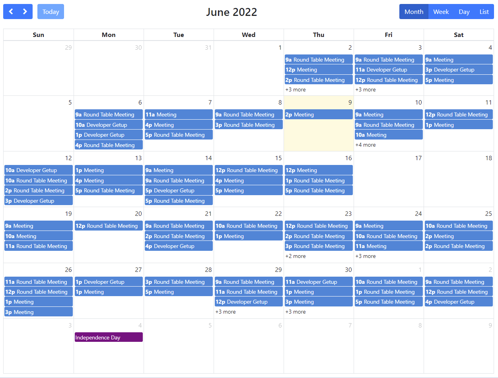
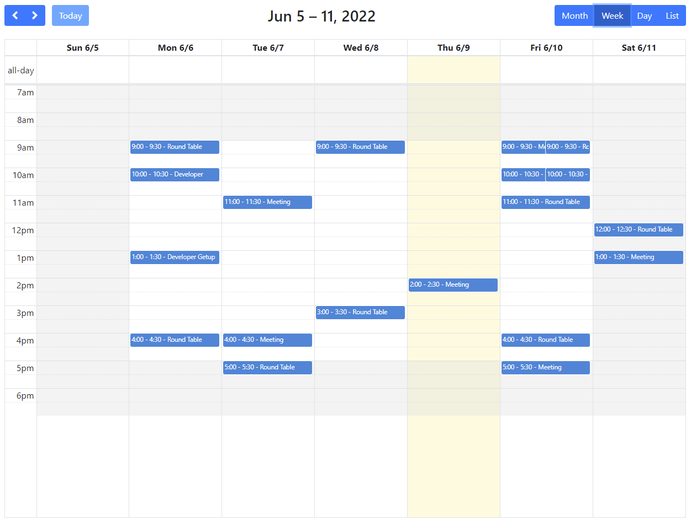
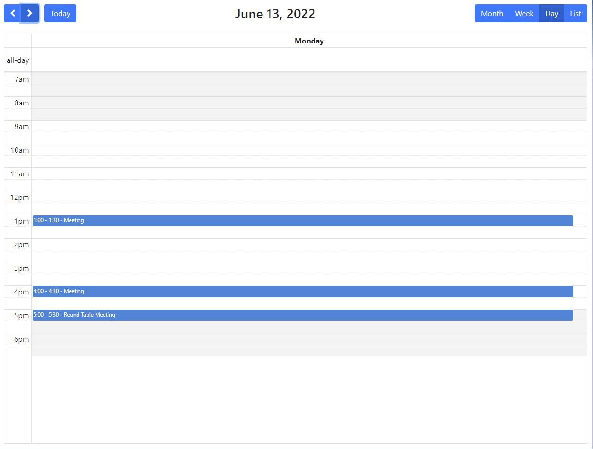
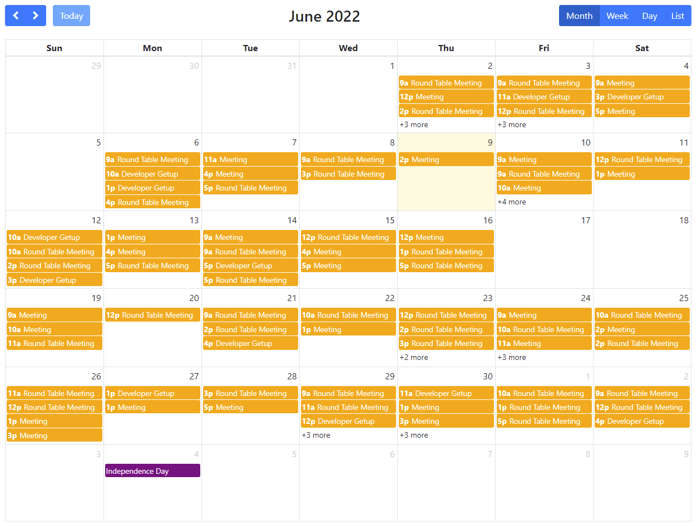
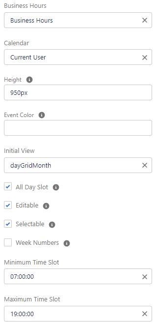

# sf-calendar

A configurable drop-in calendar for Salesforce.

# Prerequisites

* Grab my [apex-core-utils](https://github.com/MJ12358/apex-core-utils) (HolidayUtil is necessary)
* Deploy using the button below
* Assign the "Calendar" permission set to anyone who needs access

# Deploy

# Usage

* In the lightning app builder, edit the page of your choice
* Find the "Calendar" component under "Custom"
* Drag and drop it on the page

# Configuration

* You can configure the following:
  - Business Hours
  - The calendar to show (defaults to the current user)
  - The height of the calendar
  - The initial view (defaults to "dayGridMonth")
  - The all day slot
  - Whether the calendar is editable
  - Whether the calendar is selectable
  - Whether to show week numbers
  - The minimum time slot shown
  - The maximum time slot shown

# Images

## View by Week

## View by Day

## Customize your event colors

## All customizations

